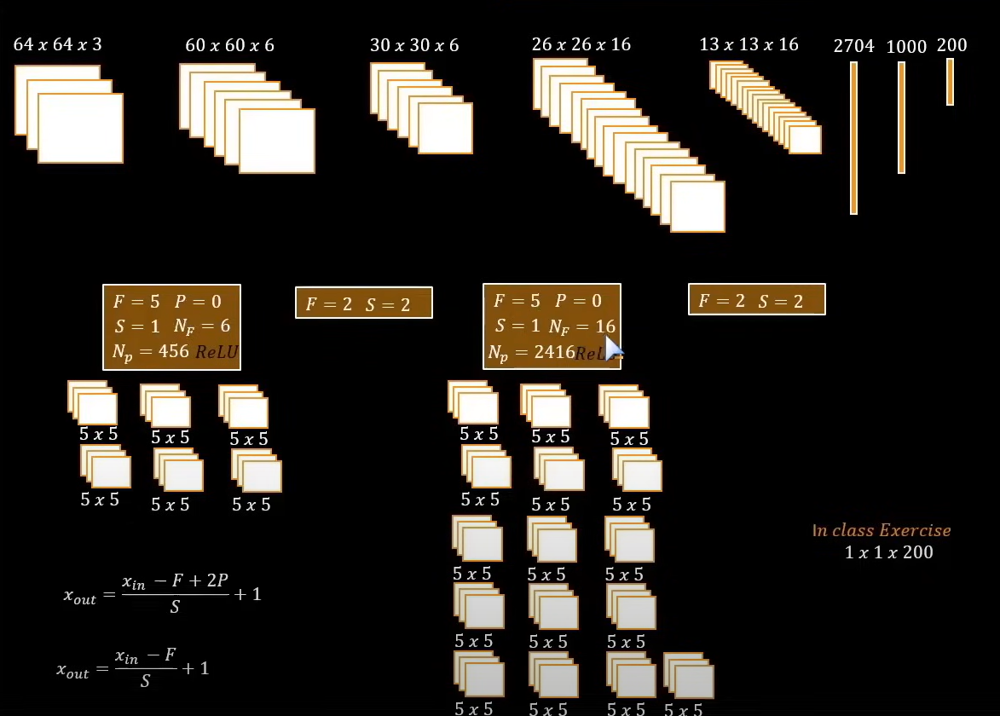
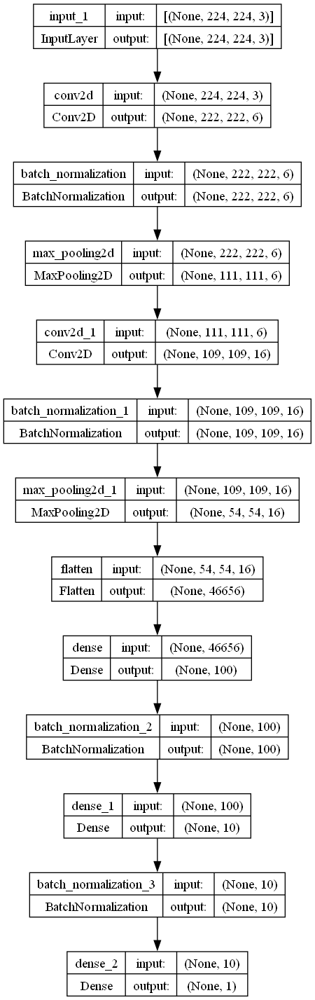
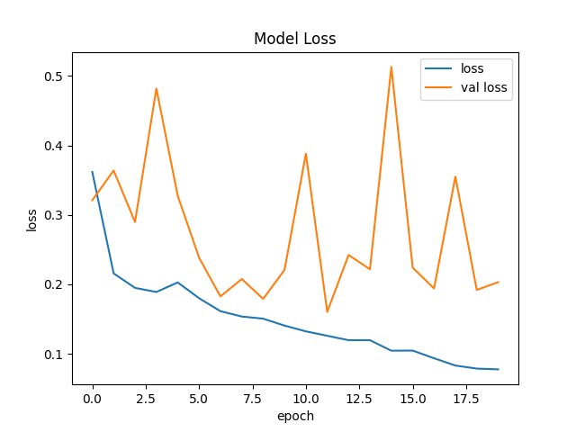
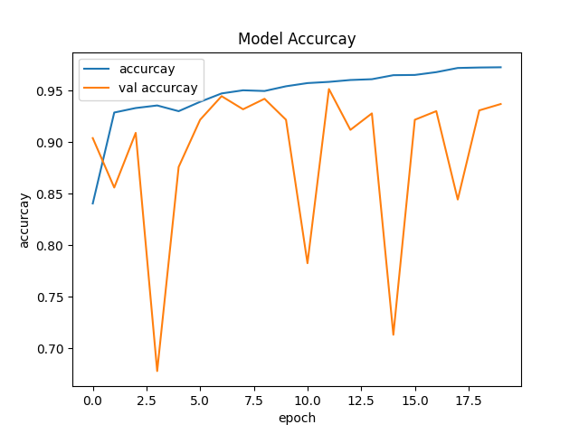
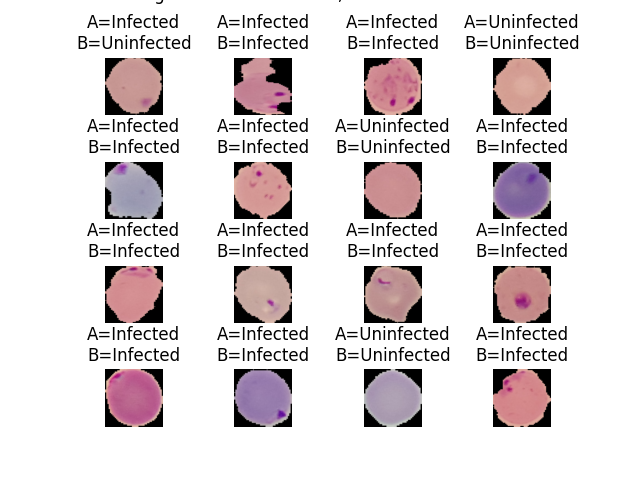

# Malaria Diagnosis Classification Model with TensorFlow

Welcome to the Malaria Diagnosis Classification Model project! This project leverages Convolutional Neural Networks (CNNs) in TensorFlow to classify whether single-cell images from thin smear blood samples are parasitized or not.

## Dataset

The dataset used for this project is sourced from TensorFlow’s own dataset of malaria. You can find the dataset [here](https://www.tensorflow.org/datasets/catalog/malaria).

## Example Images

Below are examples of an infected cell and an uninfected cell:

### Infected Cell


### Uninfected Cell


## Model Architecture

The model is built using convolutional layers with ReLU activation and a final sigmoid activation for classification. The architecture of the model is shown below:




### Key Layers:

- **Input Layer:** Takes in images of size 224x224 with 3 color channels (RGB).
- **Convolutional Layers:** Two convolutional layers with filters of size 3x3, followed by Batch Normalization and Max Pooling layers.
- **Dense Layers:** Three dense layers, with the final layer using a sigmoid activation function for binary classification.

## Training Performance

The model is trained for 20 epochs. Below are the plots showing the decrease in loss and increase in accuracy over the training epochs:

### Training Loss


### Training Accuracy


## Results

The final accuracy achieved by the model is **92.74%**.
These are the results of this model.



## Conclusion

This project successfully demonstrates the use of Convolutional Neural Networks in TensorFlow for the classification of malaria-infected cells. The high accuracy achieved by the model indicates its potential for aiding in the diagnosis of malaria.

Feel free to explore the code and data, and contribute to the project if you have any improvements or suggestions!

## Usage

To run the project, you need to have TensorFlow and TensorFlow Datasets installed. You can install the required libraries using:

```bash
pip install tensorflow tensorflow-datasets matplotlib
